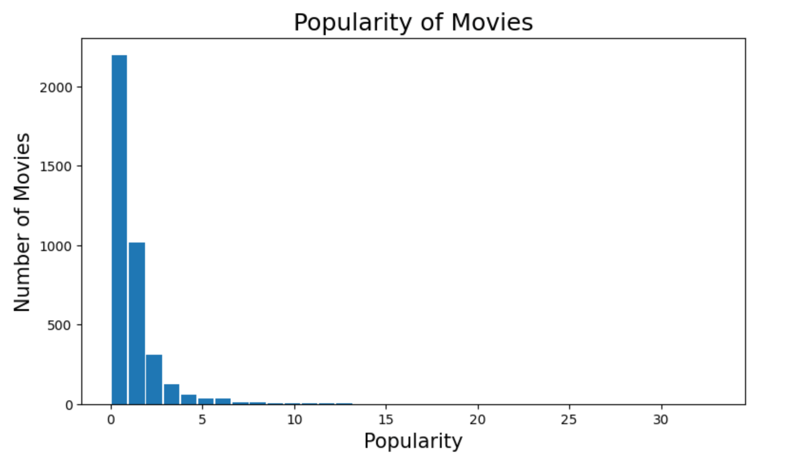
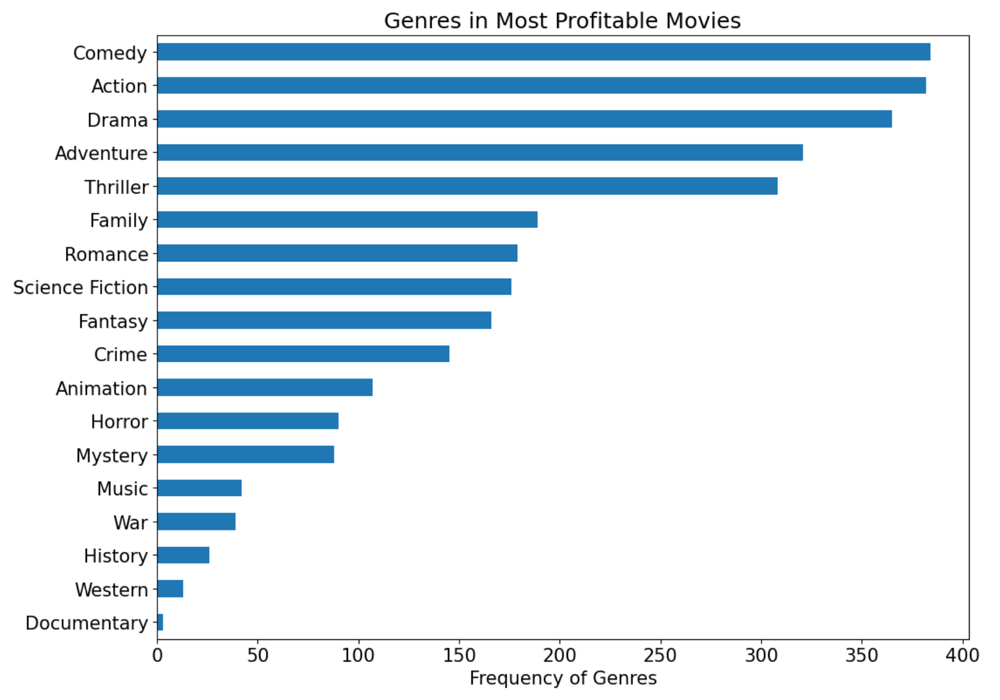

# Analysis of The Movie Dataset

## Introduction
The goal of this project is to analyze the movie dataset. In this analysis, we meticulously examine the myriad factors influencing a movie's commercial success. Leveraging an extensive dataset on cinematic productions, our objective is to elucidate the underlying patterns and determinants of blockbuster achievements.

## Dataset

The dataset is sourced from [Kaggle](https://www.kaggle.com/datasets/juzershakir/tmdb-movies-dataset). The dataset containts information about 10k+ movies collected from TMDb. The dataset is popular, but it was not updated in 6 years.

 

Below is a sample from the dataset:

| original_title      | release_year | cast                                                      | genres                                        | popularity | vote_average | budget       |
|---------------------|--------------|--------------------------------------------------------------|-----------------------------------------------|------------|--------------|--------------|
| Jurassic World      | 2015         | Chris Pratt\|Bryce Dallas Howard\|Irrfan Khan\|...           | Action\|Adventure\|Science Fiction\|Thriller | 32.985763  | 6.5          | 150,000,000.0|
| Mad Max: Fury Road  | 2015         | Tom Hardy\|Charlize Theron\|Hugh Keays-Byrne\|Nic...        | Action\|Adventure\|Science Fiction\|Thriller | 28.419936  | 7.1          | 150,000,000.0|x

## Tools

The tools used for this analysis are:

| Tool                       | Logo                                                                 | Use                      |
|:--------------------------:|:--------------------------------------------------------------------:|:------------------------:|
| [Jupyter Notebook](https://jupyter.org/) |   | Interactive Programming |
| [Python](https://www.python.org/)        |     | Data Analysis & Scripting |

## Data Processing

### Data Cleaning

- These columns were dropped as they are not needed for this analysis ['homepage', 'tagline', 'keywords', 'overview', 'release_date'].

- '0' values were fixed and all 'NaN' values were dropped in these columns ['budget', 'revenue', 'runtime'].

- **Profit** column is calculated from **revenue** & **budget** to easily analyze profitable movies.

### Exploratory Data Analysis

#### What are the most popular movies?

 

#### What are the most profitable movies?

Most profitable movies
| original_title                 | release_year | vote_average | profit        |
|:------------------------------:|:------------:|:------------:|:-------------:|
| Avatar                         | 2009         | 7.1          | 2,544,506,000 |
| Star Wars: The Force Awakens   | 2015         | 7.5          | 1,868,178,000 |
| Titanic                        | 1997         | 7.3          | 1,645,034,000 |
| Jurassic World                 | 2015         | 6.5          | 1,363,529,000 |
| Furious 7                      | 2015         | 7.3          | 1,316,249,000 |

After examining the most profitable movies, it appears they have **higher budget on average**

 

#### What are the most profitable genres?

It appears that the most popular genres are **Comedy**, **Action**, **Drama** respectively.

 

## Results

**From the analysis done above we conclude that successful movies that generate high profits have the following in common:**
- An Average budget of 50 Million Dollars.
- One of the well known actors including (Tom Cruise, Brad Pitt, Sylvester Stallone, Tom Hanks, Adam Sandler).
- One of these production companies (Universal Pictures, Warner Bros., Paramount Pictures, Twentieth Century Fox Film Corporation, Columbia Pictures).
- Includes one or more of these genres (Comedy, Action, Drama, Adventure, Thriller).

 

**Final Observation:** 

Although we got some great insights but there were some limitations

- The dataset is quite small of only 10K rows.
- 'budget' & 'revenue' had many missing or unrealistic values (It might be even in different currencies), which have affected profit column.
- Null values accounted to almost two thirds of the data, dropping them affected the analysis.
- The dataset is not up to date (updated in 6 years).
